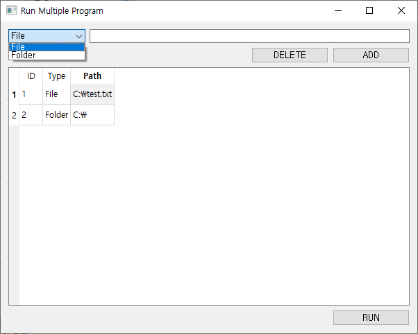
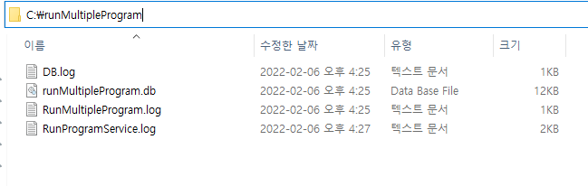

# Run Multiple Program

## 1. 소개

Windows 전용 파일 및 폴더를 한번에 실행시켜주는 프로그램.

사용언어 - Python

사용 DB - SqlLite

## 2. 기능

- 파일 및 폴더 추가 후 프로그램 한번에 실행
- 추가한 파일 및 폴더 삭제

## 3. 사용방법

1. 추가

- 일반 파일 및 프로그램
  - Select Box에서 File 선택하고 해당 파일 위치와 **확장자** 입력 후 ADD 버튼클릭
- 폴더
  - Select Box에서 Folder 선택하고 해당 폴더 위치 입력 후 ADD 버튼클릭

2. 삭제

- 삭제할 항목 클릭 후 Delete 버튼 클릭

3. 실행

- RUN 버튼으로 실행

4. 실행 및 실패 로그는 4번의 DB 및 Log경로에서 확인가능

## 4. DB 및 Log 경로

C:\runMultipleProgram

- DB.log
  - DB 실행 로그
- RunMultipleProgram.log
  - 프로그램 시작 로그
- RunProgramService.log
  - 실행 로그
- runMultipleProgram.db
  - 추가한 파일 및 폴더를 저장하는 DB

